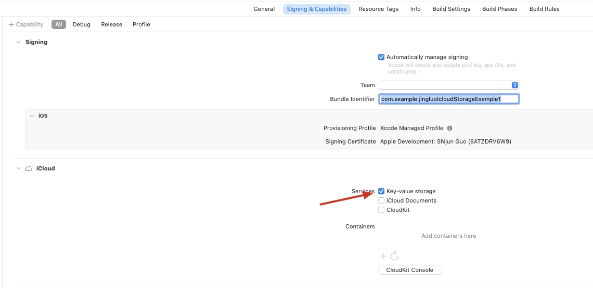

# jingluo_icloud_storage
flutter 云端存储

[](https://pub.dartlang.org/packages/jingluo_icloud_storage)


## 效果图


## Getting started

### 1. 项目配置



### 2. 使用

在 `pubspec.yaml` 添加如下:

```yaml
dependencies:
  staggered_reorderable: <latest_version>
```

导入方式如下:

```dart
import 'package:jingluo_icloud_storage/jingluo_icloud_storage.dart';
```

使用方式如下:

- 检查是否支持iCloud

```dart
var res = await JingluoIcloudStorage().isICloudEnabled();
```

返回结果如下

```text
// 成功
{msg: Success, code: 0}

// 失败
{msg: error, code: -1}
```

- 获取值

**获取值时，如果拿不到key对应的value，则返回null。可选择获取指定类型的value，获取不到则为null**

```dart
var res = await JingluoIcloudStorage().getValue(key: "localValue")
```

返回结果如下

```text
// 成功
{msg: 138, code: 0}

// 失败
{msg: error, code: -1}
```

**可选值type**
```text
enum JingluoIcloudStorageType {
  string,
  array,
  dictionary,
  data,
  long,
  double,
  bool,
  none,
}
```

- 设置值

```dart
var res = await JingluoIcloudStorage().setValue(key: "count", value: 138);
```

```text
// 成功
{msg: Success, code: 0}

// 失败
{msg: error, code: -1}
```

- 删除值

```dart
var res = await JingluoIcloudStorage().deleteValue(key: "localValue")
```

```text
// 成功
{msg: Success, code: 0}

// 失败
{msg: error, code: -1}
```

- 监听值变化

```dart
JingluoIcloudStorage().registerEventListener(onEvent: (event) {
  if (event["key"] == JingluoIcloudStorageEventType.updateICloudStorage) {
    Map? map = event["payload"]["value"];
    if (map != null && map["count"] != null) {
      idx = map["count"];
    }
    setState(() {});
  }
});
```

```text
// 成功
{payload: {code: 0, value: {count: 138}}, key: UPDATE_ICLOUD_STORAGE}
```

### 3. 常量
| 错误码 | 作用        |
|-----|-----------|
| 0   | 成功        |
| -1  | 参数错误      |
| -2  | iCloud未开启 |

| 事件Key                 | 作用                |
|-----------------------|-------------------|
| UPDATE_ICLOUD_STORAGE | UserDefaults刷新时触发 |